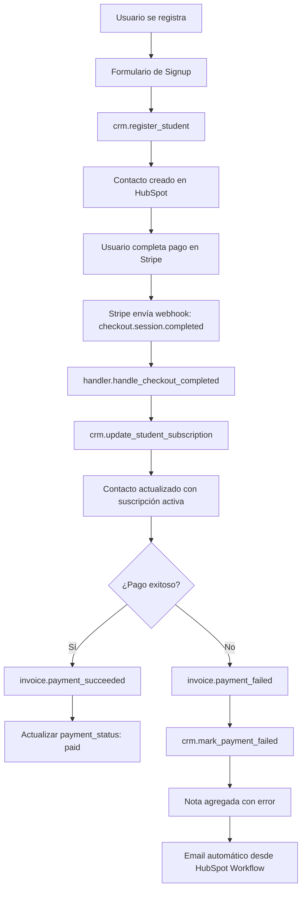

# 🎓 Focus English - Sistema CRM con Python

## 📋 Resumen Ejecutivo

Se ha implementado un **sistema completo de gestión de CRM** en Python integrado con HubSpot API. Este sistema permite gestionar contactos, suscripciones, pagos y automatizar la sincronización con Stripe.

---

## 📦 Archivos Creados

### 1. **crm_manager.py** (25 KB)
**Módulo principal del CRM**
- ✅ Clase `HubSpotCRM`: Cliente base para HubSpot API
- ✅ Clase `FocusEnglishCRM`: Lógica de negocio específica
- ✅ Gestión completa de contactos (CRUD)
- ✅ Gestión de notas y comentarios
- ✅ Gestión de deals (oportunidades)
- ✅ Creación de propiedades personalizadas
- ✅ Operaciones en batch
- ✅ Manejo robusto de errores

**Funciones Principales:**
```python
# Crear/actualizar contactos
crm.register_student(email, firstname, lastname, phone, course_interest, current_level, message)

# Actualizar suscripciones
crm.update_student_subscription(email, subscription_plan, subscription_status, payment_amount, stripe_customer_id)

# Marcar pagos fallidos
crm.mark_payment_failed(email, error_message)

# Configurar propiedades personalizadas
crm.setup_custom_properties()
```

---

### 2. **test_crm.py** (8.5 KB)
**Suite de pruebas interactiva**
- ✅ Menú interactivo de testing
- ✅ 7 tests diferentes
- ✅ Validación de conexión
- ✅ Pruebas de CRUD completo
- ✅ Pruebas de operaciones batch

**Tests Disponibles:**
1. Buscar contacto por email
2. Crear nuevo contacto
3. Actualizar contacto (suscripción)
4. Agregar nota a contacto
5. Crear múltiples contactos (batch)
6. Configurar propiedades personalizadas
7. Ejecutar todas las pruebas

**Uso:**
```bash
python test_crm.py
```

---

### 3. **stripe_webhook_integration.py** (14 KB)
**Integración con Webhooks de Stripe**
- ✅ Clase `StripeWebhookHandler`
- ✅ Manejo de 8 tipos de eventos de Stripe
- ✅ Sincronización automática con HubSpot
- ✅ Simulador de webhooks para testing

**Eventos Manejados:**
- ✅ `checkout.session.completed` → Crear cliente y suscripción
- ✅ `customer.subscription.created` → Nueva suscripción
- ✅ `customer.subscription.updated` → Actualizar estado
- ✅ `customer.subscription.deleted` → Marcar cancelada
- ✅ `invoice.payment_succeeded` → Actualizar pago exitoso
- ✅ `invoice.payment_failed` → Marcar pago fallido
- ✅ `customer.created` → Crear contacto
- ✅ `payment_intent.succeeded` → Confirmar pago

**Uso:**
```python
from stripe_webhook_integration import StripeWebhookHandler

handler = StripeWebhookHandler()
result = handler.handle_event(stripe_event)
```

---

### 4. **CRM_PYTHON_DOCS.md** (14 KB)
**Documentación completa**
- ✅ Guía de instalación
- ✅ Configuración paso a paso
- ✅ API Reference completa
- ✅ Ejemplos de código
- ✅ Flujo de trabajo completo
- ✅ Troubleshooting
- ✅ Best practices

---

### 5. **requirements.txt**
**Dependencias Python**
```
requests>=2.31.0
python-dotenv>=1.0.0
```

**Instalación:**
```bash
pip install -r requirements.txt
```

---

### 6. **.env.example** (actualizado)
**Variables de entorno necesarias**
```bash
# HubSpot CRM Configuration
HUBSPOT_ACCESS_TOKEN=pat-xxx-your-private-app-token-here
HUBSPOT_API_KEY=pat-xxx-your-private-app-token-here
HUBSPOT_PORTAL_ID=your_hubspot_portal_id_here
HUBSPOT_API_URL=https://api.hubapi.com
```

---

## 🚀 Quickstart

### 1. Instalar Dependencias
```bash
pip install -r requirements.txt
```

### 2. Configurar Variables de Entorno
```bash
# Copiar ejemplo
cp .env.example .env

# Editar .env y agregar tu token de HubSpot
nano .env
```

### 3. Obtener Token de HubSpot
1. Ve a **Settings** → **Integrations** → **Private Apps**
2. Crea una nueva Private App
3. Configura los scopes necesarios:
   - `crm.objects.contacts.read`
   - `crm.objects.contacts.write`
   - `crm.schemas.contacts.read`
   - `crm.schemas.contacts.write`
4. Copia el token y pégalo en `.env`

### 4. Configurar Propiedades Personalizadas (primera vez)
```bash
python crm_manager.py
```

Esto creará automáticamente todas las propiedades necesarias en HubSpot:
- `subscription_plan`
- `subscription_status`
- `current_level`
- `course_interest`
- `payment_status`
- `stripe_customer_id`
- `last_payment_amount`
- `last_payment_date`
- `subscription_start_date`

### 5. Probar el Sistema
```bash
python test_crm.py
```

Esto abrirá un menú interactivo para probar todas las funcionalidades.

---

## 💡 Casos de Uso

### Caso 1: Registrar Nuevo Estudiante
```python
from crm_manager import FocusEnglishCRM

crm = FocusEnglishCRM()

result = crm.register_student(
    email='estudiante@ejemplo.com',
    firstname='Juan',
    lastname='Pérez',
    phone='+34612345678',
    course_interest='Inglés Profesional',
    current_level='B1',
    message='Quiero mejorar mi inglés para el trabajo'
)

print(f"✅ Estudiante registrado con ID: {result['id']}")
```

### Caso 2: Actualizar Suscripción tras Pago en Stripe
```python
crm.update_student_subscription(
    email='estudiante@ejemplo.com',
    subscription_plan='Premium Monthly',
    subscription_status='active',
    payment_amount=29.99,
    stripe_customer_id='cus_abc123'
)
```

### Caso 3: Manejar Pago Fallido
```python
crm.mark_payment_failed(
    email='estudiante@ejemplo.com',
    error_message='Tarjeta rechazada - fondos insuficientes'
)
```

### Caso 4: Webhook de Stripe
```python
from stripe_webhook_integration import StripeWebhookHandler

handler = StripeWebhookHandler()

# En tu endpoint de webhook
@app.post('/webhook/stripe')
async def stripe_webhook(request):
    event = stripe.Webhook.construct_event(
        await request.body(),
        request.headers.get('stripe-signature'),
        STRIPE_WEBHOOK_SECRET
    )
    
    result = handler.handle_event(event)
    return {'status': 'success', 'result': result}
```

---

## 📊 Propiedades Personalizadas Creadas

### Información del Estudiante
| Propiedad | Tipo | Valores |
|-----------|------|---------|
| `current_level` | Enum | A1, A2, B1, B2, C1, C2, unknown |
| `course_interest` | Text | Texto libre |

### Información de Suscripción
| Propiedad | Tipo | Valores |
|-----------|------|---------|
| `subscription_plan` | Text | Texto libre (ej: "Premium Monthly") |
| `subscription_status` | Enum | active, cancelled, past_due, trialing |
| `subscription_start_date` | Date | Fecha ISO (YYYY-MM-DD) |

### Información de Pago
| Propiedad | Tipo | Valores |
|-----------|------|---------|
| `payment_status` | Enum | paid, failed, pending |
| `last_payment_amount` | Number | Monto en decimales |
| `last_payment_date` | Date | Fecha ISO (YYYY-MM-DD) |

### Datos de Integración
| Propiedad | Tipo | Valores |
|-----------|------|---------|
| `stripe_customer_id` | Text | ID de Stripe (ej: "cus_abc123") |

---

## 🔄 Flujo de Trabajo Completo



---

## 🎯 Workflows Recomendados en HubSpot

### 1. Email de Bienvenida
**Trigger:** `subscription_status` = `active` (primera vez)
**Acción:** Enviar email de bienvenida con acceso a la plataforma

### 2. Email de Pago Fallido
**Trigger:** `payment_status` = `failed`
**Acción:** Enviar recordatorio para actualizar método de pago

### 3. Serie de Onboarding (5 emails)
**Trigger:** `subscription_status` = `active` (primera vez)
**Acciones:**
- Día 0: Bienvenida y primeros pasos
- Día 2: Primeras lecciones
- Día 5: Check-in de progreso
- Día 10: Técnicas de estudio
- Día 15: Preparación para examen

### 4. Re-engagement (Inactividad)
**Trigger:** No ha visitado el sitio en 7 días + `subscription_status` = `active`
**Acción:** Email motivacional con nuevas lecciones

### 5. Renovación Próxima
**Trigger:** `subscription_current_period_end` < 3 días
**Acción:** Recordatorio de renovación

---

## 📈 Métricas y Reportes

### Dashboard Sugerido en HubSpot

**Métricas de Suscripciones:**
- Total suscriptores activos
- Nuevas suscripciones este mes
- Cancelaciones este mes
- Churn rate
- MRR (Monthly Recurring Revenue)

**Métricas de Engagement:**
- Tasa de apertura de emails
- Click-through rate
- Visitas a la plataforma
- Progreso en cursos

**Métricas de Pagos:**
- Pagos exitosos
- Pagos fallidos
- Revenue por plan
- Lifetime value promedio

---

## 🐛 Troubleshooting

### Error: "HubSpot API key no configurada"
**Solución:**
```bash
# Verifica que .env contenga:
HUBSPOT_ACCESS_TOKEN=pat-xxx-your-token-here
```

### Error: "Insufficient permissions"
**Solución:** Verifica scopes en tu Private App:
- `crm.objects.contacts.read`
- `crm.objects.contacts.write`
- `crm.schemas.contacts.read`
- `crm.schemas.contacts.write`

### Error: "Property does not exist"
**Solución:**
```python
from crm_manager import FocusEnglishCRM
crm = FocusEnglishCRM()
crm.setup_custom_properties()
```

### Error: "Contact already exists"
**Solución:** Usa `create_or_update_contact()` en lugar de `create_contact()`

---

## 📚 Recursos Adicionales

### Documentación
- **CRM_PYTHON_DOCS.md** - Documentación completa de la API Python
- **HUBSPOT_INTEGRATION_GUIDE.md** - Guía de configuración de HubSpot
- [HubSpot API Documentation](https://developers.hubspot.com/docs/api/overview)
- [Stripe Webhooks](https://stripe.com/docs/webhooks)

### Scripts
- **crm_manager.py** - Módulo principal
- **test_crm.py** - Suite de pruebas
- **stripe_webhook_integration.py** - Integración con Stripe

---

## ✅ Checklist de Implementación

### Setup Inicial
- [ ] Instalar dependencias: `pip install -r requirements.txt`
- [ ] Configurar `.env` con `HUBSPOT_ACCESS_TOKEN`
- [ ] Ejecutar `crm.setup_custom_properties()`
- [ ] Probar conexión con `python test_crm.py`

### Integración con Proyecto
- [ ] Integrar `crm.register_student()` en formulario de signup
- [ ] Configurar webhooks de Stripe
- [ ] Implementar `StripeWebhookHandler` en endpoint de webhook
- [ ] Configurar workflows de email en HubSpot
- [ ] Crear dashboards de métricas en HubSpot

### Testing
- [ ] Probar registro de estudiantes
- [ ] Probar actualización de suscripciones
- [ ] Simular pagos exitosos
- [ ] Simular pagos fallidos
- [ ] Verificar sincronización con Stripe

### Producción
- [ ] Verificar variables de entorno en producción
- [ ] Configurar monitoring de errores
- [ ] Documentar procesos para el equipo
- [ ] Capacitar al equipo en uso del CRM

---

## 🎉 Siguientes Pasos

1. **Ejecutar Tests:** `python test_crm.py`
2. **Leer Documentación:** `CRM_PYTHON_DOCS.md`
3. **Configurar Propiedades:** `crm.setup_custom_properties()`
4. **Integrar con Formularios:** Usar en signup
5. **Configurar Webhooks:** Implementar handler de Stripe
6. **Crear Workflows:** Configurar emails automáticos en HubSpot

---

## 📞 Soporte

Para preguntas o issues:
1. Revisa `CRM_PYTHON_DOCS.md` para documentación detallada
2. Revisa `HUBSPOT_INTEGRATION_GUIDE.md` para configuración de HubSpot
3. Consulta [HubSpot Developer Documentation](https://developers.hubspot.com)

---

**Última actualización:** 16 de Enero de 2026  
**Versión:** 1.0.0  
**Autor:** GenSpark AI Developer  
**Proyecto:** Focus English CRM System
